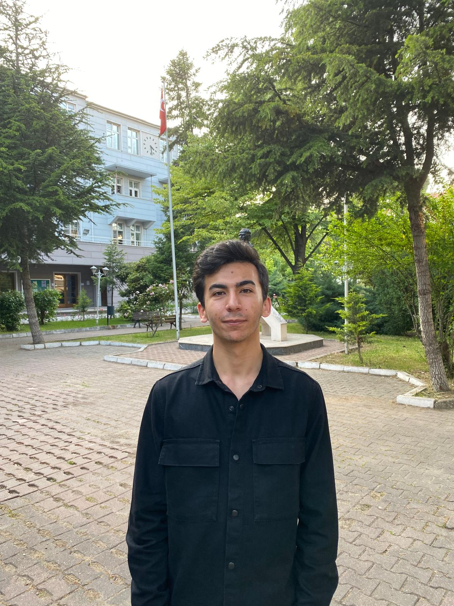

{fig-align="center" width="400"}

[CV İndir](files/cv.pdf)

# Education

-   B.S., Industrial Engineering, Balikesir.University, Turkey, 2021 - 2025.
-   Erasmus+ Exchange Program, Industrial Engineering, Balikesir.University, Turkey, 2024 .
-   M.S., Industrial Engineering, Hacettepe University, Turkey, 2026 - ongoing.

# Work Experience

## Employements

## Internships

-   BEST Transformer A.Ş., position Engineering Intern, year 2025

# Projects

# Publications

# Competencies

R, Quarto, Git, Python, Microsoft Office, Rockawell Arena, Solidworks, AutoCAD

# Hobbies

Psychology, Philosophy, Basketball, Violin
